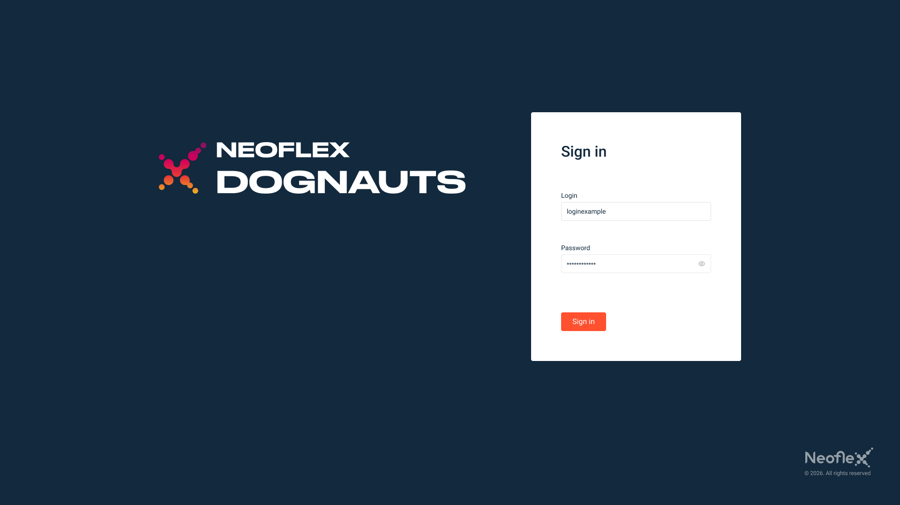
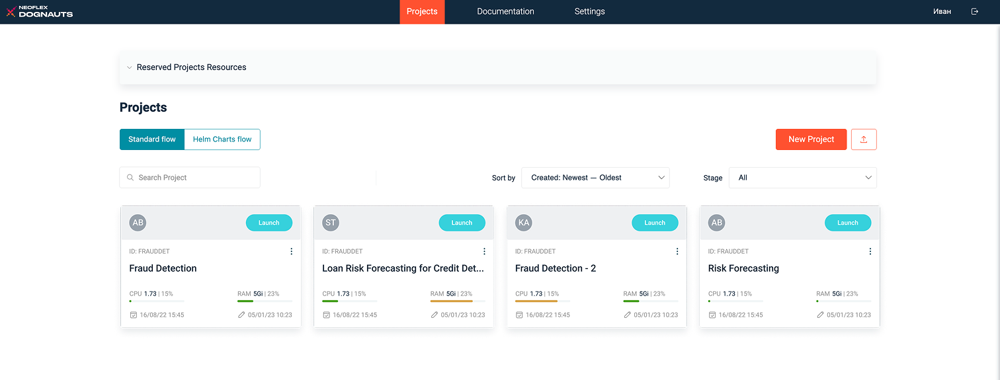
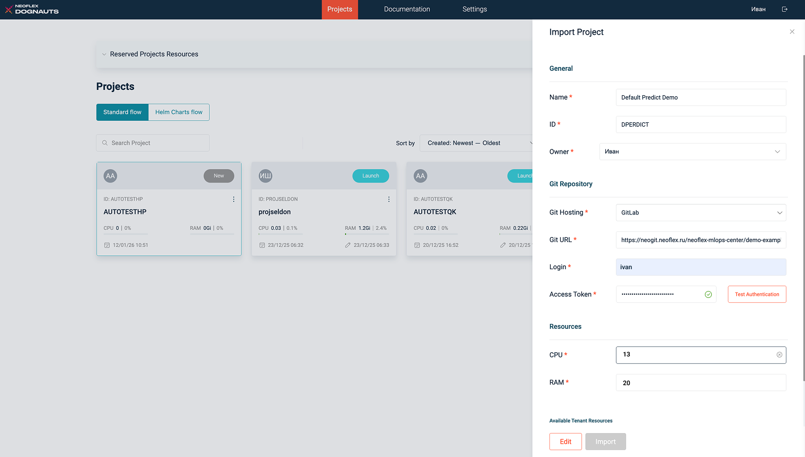
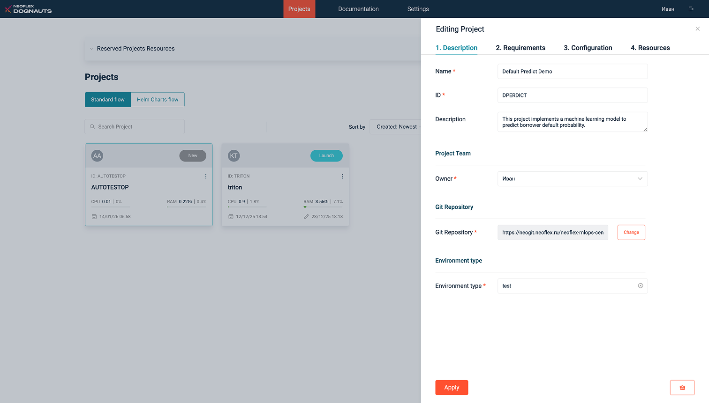
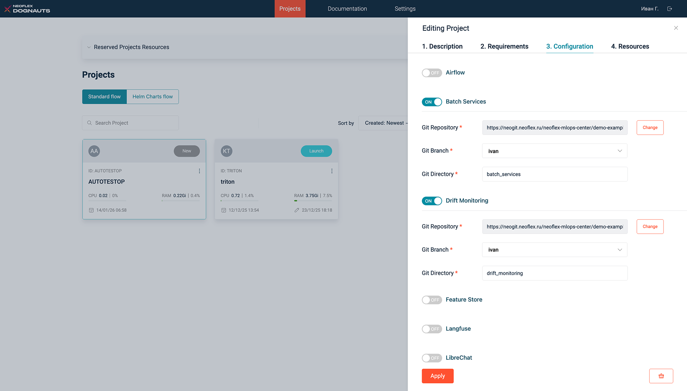
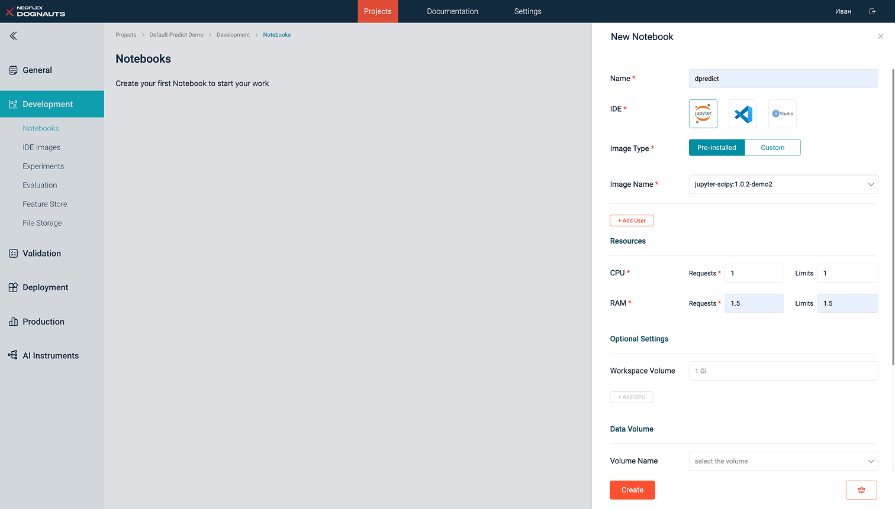
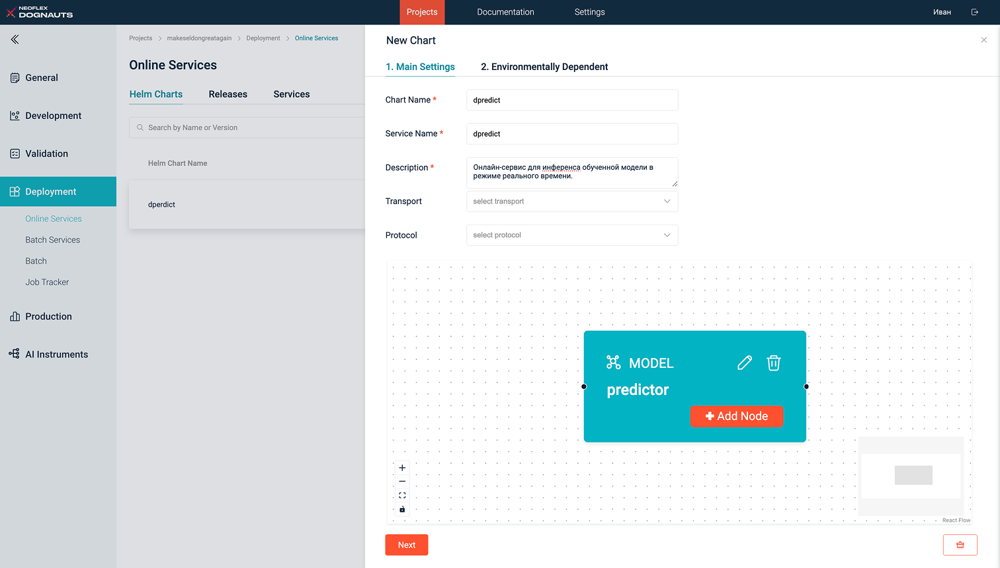
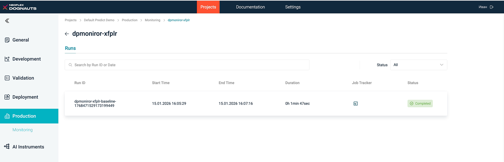
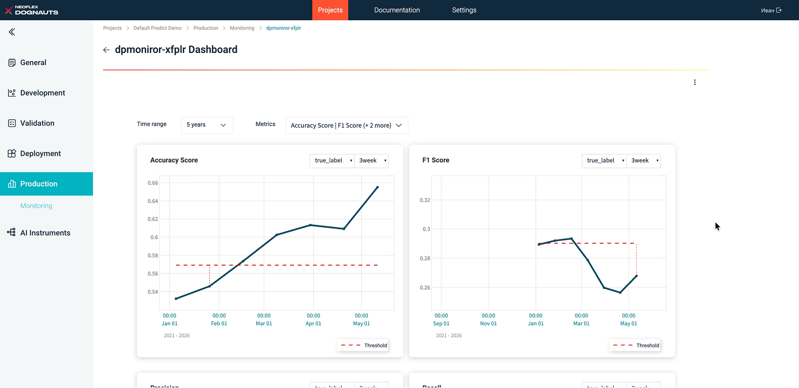

# Оглавление

- [Оглавление](#оглавление)
- [Введение](#введение)
  - [Тестовый проект](#тестовый-проект)
    - [Модель](#модель)
    - [Артефакты](#артефакты)
  - [Требования к инфраструктуре и пререквизиты](#требования-к-инфраструктуре-и-пререквизиты)
- [Прохождение демонстрационного сценария](#прохождение-демонстрационного-сценария)
  - [Авторизация](#авторизация)
  - [Импорт проекта](#импорт-проекта)
  - [Настройка среды разработки](#настройка-среды-разработки)
  - [Обучение модели](#обучение-модели)
  - [Применение модели](#применение-модели)
    - [Online-применение](#online-применение)
      - [Выполнение запросов к модели](#выполнение-запросов-к-модели)
      - [Завершение работы с online-сервисом](#завершение-работы-с-online-сервисом)
    - [Пакетное применение](#пакетное-применение)
      - [Настройка среды разработки](#настройка-среды-разработки-1)
      - [Подготовка данных для primary batch inference](#подготовка-данных-для-primary-batch-inference)
      - [Создание и запуск Batch Service для primary-данных](#создание-и-запуск-batch-service-для-primary-данных)
      - [Завершение primary-пайплайна](#завершение-primary-пайплайна)
      - [Подготовка данных для baseline batch inference](#подготовка-данных-для-baseline-batch-inference)
      - [Создание и запуск Batch Service для baseline-данных](#создание-и-запуск-batch-service-для-baseline-данных)
      - [Завершение baseline-пайплайна](#завершение-baseline-пайплайна)
      - [Завершение работы с пакетными сервисами](#завершение-работы-с-пакетными-сервисами)
  - [Мониторинг](#мониторинг)
    - [Создание источника данных](#создание-источника-данных)
    - [Настройка Drift Monitor](#настройка-drift-monitor)
    - [Просмотр результатов мониторинга](#просмотр-результатов-мониторинга)
  - [Завершение работы](#завершение-работы)

# Введение

Данное пошаговое руководство предназначено для знакомства новых пользователей с ключевыми возможностями платформы Neoflex Dognauts на примере сквозного демонстрационного сценария.

В рамках Demo Guide рассматривается ML-сценарий, включающий следующие этапы:
1. **Обучение модели и Online inference.** Подготовка данных и признаков, обучение модели, регистрация модели в MLflow, развертывание online-сервиса и тестирование прогнозов через API.
2. **Batch inference.** Создание и запуск batch-сервиса на основе ранее зарегистрированной модели для массового расчета прогнозов.
3. **Мониторинг качества и данных.**  Настройка Drift Monitoring для анализа изменений входных данных и качества предсказаний модели на основе результатов Batch inference.


Прохождение демонстрационного сценария позволяет:
+ Понять логику работы основных компонентов платформы.
+ Увидеть, как отдельные сервисы объединяются в единый ML-pipeline.
+ Получить практический опыт развертывания и эксплуатации модели.

## Тестовый проект

Тестовый проект содержит все необходимые артефакты, предназначенные для загрузки в платформу без необходимости разработки, ускоряет знакомство с платформой и обеспечивает прохождение основных этапов жизненного цикла модели.

> Локальную копию проекта можно дорабатывать по собственному усмотрению.

### Модель

В качестве примера используется демо-модель прогноза дефолта заемщика, для которой в рамках демонстрационного сценария последовательно воспроизводятся следующие этапы работы в платформе:
1. Импорт проекта и настройка рабочего окружения.
2. Обучение модели на подготовленных данных в среде Jupyter Notebook.
3. Регистрация обученной модели, метрик и артефактов в MLflow.
4. Развертывание модели в виде online-сервиса и получение прогнозов через API.
5. Создание пакетного сервиса для batch-применения модели.
6. Подключение мониторинга качества и данных на основе результатов Batch inference.

> Детальная информация о всех компонентах и базовых действиях внутри платформы представлена в Руководстве пользователя.

### Артефакты

**Ссылка на публичный репозиторий проекта:**  

## Требования к инфраструктуре и пререквизиты

Для корректного выполнения всех шагов демонстрационного сценария должны быть выполнены следующие условия: 
1. Исходные артефакты демонстрационного проекта импортированы в используемую систему контроля версий.
2. Репозиторий с демонстрационными артефактами доступен по URL.
3. В репозитории создана отдельная рабочая ветка, которая будет использоваться при прохождении демонстрационного сценария.
4. Для подключения Git-репозитория к платформе должен быть заранее создан персональный токен доступа с минимально необходимыми правами:
   + *api* - доступ к API системы контроля версий, необходимый для интеграции с платформой.
   + *read_api* - чтение данных через API.
   + *read_repository* - чтение содержимого репозитория.
   + *write_repository* - запись в репозиторий.
5. В используемом Registry размещены и зарегистрированы в платформе следующие образы среды разработки:
   - *jupyter-scipy:release-1.0.2*
   - *jupyter-scipy:release-1.1.3*

# Прохождение демонстрационного сценария

> В данном разделе последовательно описаны действия, необходимые для прохождения демонстрационного сценария.
## Авторизация 

> **Цель**: выполнить вход в web-интерфейс платформы под пользовательской учетной записью.

> **Для выполнения** используйте предоставленные администратором платформы учетные данные для доступа к интерфейсу.

Для работы с платформой вам необходимо иметь:

- Доступ к платформе по URL.
- Учетную запись для аутентификации.
> **Примечание**: URL платформы и учетные записи могут отличаться в зависимости от окружения.

Перейдите по URL платформы и введите данные вашей учетной записи.



## Импорт проекта

> **Цель**: загрузить в платформу демонстрационный проект, выполнить настройку подключения к Git-репозиторию и включить необходимые компоненты платформы. 

> **Для выполнения** импортируем проект в платформу и укажем параметры, необходимые для дальнейшей работы с артефактами проекта и сервисами платформы.

На странице просмотра списка проектов нажмите **Import Project**, если вы впервые входите в платформу, или , если в платформе уже создан хотя бы один проект.




Далее на форме импорта проекта укажите следующие сведения:



+ *Owner* – выберите имя текущего пользователя, под учетной записью которого выполнен вход в платформу.
+ *Git Hosting* – выберите название Git-хостинга, в котором размещён репозиторий с артефактами демонстрационного проекта. 
+ *Git URL* – укажите URL-адрес репозитория.
+ *Login* – укажите имя учетной записи пользователя в системе контроля версий.
+ *Access Token* – введите персональный токен доступа, созданный ранее в системе контроля версий.<br/> После этого нажмите **Test Authentication**, чтобы проверить корректность указанных учетных данных.<br/> В случае, если проверка учетных данных будет успешно пройдена, в поле *Access Token* отобразится соответствующий статус.

После заполнения всех полей нажмите **Edit**, чтобы перейти к расширенной настройке параметров проекта и его компонентов.



На отобразившейся вкладке *Description* в поле *Owner* выберите имя текущего пользователя, под учетной записью которого выполнен вход в платформу.

Затем в поле *Environment type* выберите **test**.

> Данный параметр используется для логического разделения проектов по типу окружения и не влияет на выполнение демонстрационного сценария.

Далее перейдите на вкладку *Configuration* для включения и настройки компонентов проекта, используемых в демонстрационном сценарии.



Напротив каждого компонента **Batch Services**, **Drift Monitoring**, **MLflow**, **PG Vector** и **Seldon** установите переключатель в положение **ON**, а затем в поле _Git Branch_ для каждого компонента выберите название рабочей ветки репозитория, созданной на этапе подготовки инфраструктуры.

Когда все сведения на форме редактирования проекта будут указаны, нажмите **Apply**, чтобы сохранить изменения конфигурации.

После этого на форме импорта проекта нажмите **Import**. Через некоторое время проект *Default Predict Demo* будет создан и отобразится в списке на странице *Projects*.

## Настройка среды разработки

Переходим в карточку проекта. В левом меню выбираем *Development → Notebooks*.


Затем создаем новую среду разработки. Для целей базовой демонстрации достаточно указать:

- *Name* – введите **dpredict**.
- *IDE* – **Jupyter**.
- *Image Name*: **jupyter-scipy:1.0.2-demo2**.
- *Resources* – объем выделяемых ресурсов для ноутбука:
  -  *CPU* – **1**. 
  -  *RAM* – **1,5**. 



Когда необходимые сведения будут указаны, нажмите **Create**. После этого информация о ноутбуке *dpredict* отобразится в списке сред разработки.

## Обучение модели 

> **Цель**: обучить демонстрационную модель, залогировать результаты эксперимента и зарегистрировать модель в MLflow для дальнейшего использования в Online и Batch сценариях.

> **Для выполнения** воспроизведем демонстрационный ноутбук в подготовленной среде разработки, обучим модель и зарегистрируем её в MLflow.

Дождитесь, когда созданная среда разработки перейдет в статус *Ready*, а затем перейдите в неё, кликнув на логотип IDE.

Далее в открывшейся среде разработки склонируйте Git-репозиторий проекта, указанный при создании проекта, и переключитесь на рабочую ветку.

После этого откройте ноутбук *default-predict-demo.ipynb*. Данный ноутбук реализует обучение демонстрационной модели для задачи прогнозирования дефолта по кредитам на основе персональных данных заемщика и его кредитной истории.

Перед запуском ноутбука в соответствующих ячейках настройте переменные окружения для аутентификации и подключения к MLflow:

```python
import os
os.environ["MLFLOW_TRACKING_URI"] = 'https://{{Базовый URL платформы}}/project-api/{ID проекта}/mlflow/'
os.environ["MLFLOW_TRACKING_TOKEN"] = '{{Пользовательский Bearer токен}}'
```
После указания переменных окружения выполните все ячейки ноутбука последовательно.

По завершении выполнения ноутбука убедитесь, что:
1. В пункте меню *Development → Experiments* появился эксперимент с именем *autotestPredict*.
2. Внутри эксперимента зафиксирован успешно завершённый Run.
3. Артефакты модели сохранены в S3-бакете проекта по пути *s3://app-<project-id>/<experiment_id>/<run_id>*.

Для дальнейшего использования модели выполните её регистрацию в MLflow:
+ Откройте соответствующий Run эксперимента.
+ Cоздайте новую модель, указав произвольное имя.
+ Убедитесь, что модель отображается в списке на странице *Models*.

После выполнения данного шага обученная модель готова к использованию в сценариях Online и Batch применения.

## Применение модели

> На основе результатов экспериментов трансформируем обученную модель в исполняемую.

### Online-применение

> **Цель:** развернуть обученную и зарегистрированную в MLflow модель в виде online-сервиса для получения прогнозов в режиме реального времени.

> **Для выполнения** создадим Helm Chart online-сервиса, а затем развернём сервис в кластере Kubernetes.

Перейдите в раздел *Deployment → Online Services* и на вкладке *Helm Charts* нажмите **+ New Chart**.

На вкладке *1. Main Settings* укажите основные параметры чарта:
+ *Chart Name* - **dpredict**.
+ *Service Name* - **dpredict**.
+ *Description* - **Online-сервис для инференса обученной модели в режиме реального времени.**

Далее в блоке создания графа нажмите **Add Root Node**, а затем на отобразившейся форме добвления корневой ноды укажите её основные параметры:
+ *Node Name* - **predictor**.
+ *Type* - **MODEL**.

> Нода *MODEL* является основной вычислительной единицей сервиса и отвечает за выполнение инференса зарегистрированной модели.

Когда основные параметры корневой ноды будут указаны, нажмите **Next**, чтобы перейти к заполнению вкладки параметров окружения *2. Environmentally Dependent*: 

+ *S3 URI* - путь к модели в S3-хранилище. Чтобы определить корректный путь, выполните следующие действия:
  1. В новой вкладке браузера откройте UI платформы. Далее в проекте *Default Predict Demo* перейдите в раздел *Development → Experiments*.
  2. В веб-интерфейсе MLflow в основном меню выберите пункт *Experiments*.
  3. Откройте эксперимент с названием *autotestPredict*.
  4. В списке запусков нажмите на название интересующего Run.
  5. Перейдите на вкладку *Artifacts* и скопируйте отображаемый путь к артефактам модели.
  6. Вернитесь к форме настройки ноды и вставьте скопированный путь в поле *S3 URI*.
+ В блоке *CPU* укажите:
  + *Requests* - **3**.
  + *Limits* - **3**.
+ В блоке *RAM* укажите:
  + *Requests* - **3**.
  + *Limits* - **3**.

Когда параметры окружения будут указаны, нажмите **Apply**. В результате нода будет создана, а сведения о ней отобразятся в блоке создания и визуализации графа.



После того как вы заполнили основные сведения о чарте, настроили структуру графа и добавили ноду, нажмите **Next**. Далее на вкладке *2. Environmentally Dependent* нажмите **Create**, чтобы сгенерировать чарт онлайн-сервиса. В результате сведения о новом чарте отобразятся в списке на вкладке *Helm Charts*.

Чтобы развернуть online-сервис, в списке напротив названия *dpredict* нажмите **Install|Upgrade**. Далее на отобразившейся форме *Install Helm Chart | Upgrade Helm Release* нажмите **Apply**. 

После этого новый сервис будет развернут, а информация о нем отобразится на вкладке *Services*.

#### Выполнение запросов к модели 

> **Цель:** проверить корректность развертывания online-сервиса и убедиться, что модель успешно обрабатывает входные запросы.

> **Для выполнения** отправим тестовый POST-запрос к REST API модели через Swagger UI.

После успешного запуска online-сервиса перейдите на вкладку *Deployment → Online Services → Services* и нажмите , чтобы перейти в Swagger UI соответствующей модели.

Затем выполните POST-запрос к эндпоинту */seldon/app-dpredict/.../api/v1.0/predictions*.

В теле запроса передайте тестовые данные в следующем формате:

```json
{
  "data":{
    "names":[
      "sex", "age", "car", "car_type", "decline_app_cnt", "good_work", "score_bki", "bki_request_cnt", "income",
      "foreign_passport", "days", "education_ACD", "education_GRD", "education_PGR", "education_SCH", "education_UGR",
      "region_rating_20", "region_rating_30", "region_rating_40", "region_rating_50", "region_rating_60", "region_rating_70",
      "region_rating_80", "home_address_1", "home_address_2", "home_address_3", "work_address_1", "work_address_2",
      "work_address_3", "sna_1", "sna_2", "sna_3", "sna_4", "first_time_1", "first_time_2", "first_time_3", "first_time_4"
    ],
    "tensor":{
      "shape":[
        1,
        37
      ],
      "values":[
        0, 3.4011973816621555, 0, 0, 0.6931471805599453, 0, 1.19598062, 1.3862943611198906, 10.043292972227004, 0, 73,
        0, 0, 0, 0, 1, 0, 0, 1, 0, 0, 0, 0, 1, 0, 0, 0, 1, 0, 1, 0, 0, 0, 0, 0, 0, 1
      ]
    }
  }
}
```

Убедитесь, что сервис возвращает ответ с HTTP-кодом 200, содержащий результат предсказания модели. Успешное выполнение запроса подтверждает корректное развертывание online-сервиса.

#### Завершение работы с online-сервисом

> **Цель:** освободить вычислительные ресурсы платформы после завершения проверки online-применения модели.

> **Для выполнения** остановим компонент Seldon на уровне проекта.

После проверки корректности работы online-сервиса перейдите на страницу *General → Configuration*. В списке компонентов напротив *Seldon* переведите переключатель в положение **OFF**.

В результате выделенные ресурсы кластера будут высвобождены. 

### Пакетное применение

> **Цель:** выполнить пакетный расчет прогнозов обученной модели на двух наборах данных (primary и baseline) и подготовить результаты для последующего мониторинга качества и данных.

> **Для выполнения** последовательно выполним два сценария пакетного применения модели, каждый из которых включает:
>
> 1. Подготовку входных данных в Jupyter Notebook.
> 2. Запуск Batch Service в интерфейсе платформы.
> 3. Загрузку результатов инференса и их сохранение в БД.

#### Настройка среды разработки 

> **Цель:** создать среду разработки, используемую для подготовки данных и загрузки результатов пакетного инференса.

> **Для выполнения** создадим Jupyter Notebook на базе образа среды разработки, предназначенного для пакетного применения и мониторинга.

Перейдите в раздел *Development → Notebooks* и создайте новый ноутбук со следующими параметрами:
- *Name* – введите **dpredict1**.
- *IDE* – **Jupyter**.
- *Image Name*: **jupyter-scipy:release-1.1.3**.
- *Resources* – объем выделяемых ресурсов для ноутбука:
  -  *CPU* – **1**. 
  -  *RAM* – **1,5**. 

Когда необходимые сведения будут указаны, нажмите **Create**. После этого информация о ноутбуке *dpredict1* отобразится в списке сред разработки.

Дождитесь, когда созданная среда разработки перейдет в статус *Ready*, а затем перейдите в неё, кликнув на логотип IDE.

Далее в открывшейся среде разработки склонируйте Git-репозиторий проекта, указанный при создании проекта, и переключитесь на рабочую ветку.

#### Подготовка данных для primary batch inference

> **Цель:** подготовить входной набор признаков для пакетного инференса модели на primary-данных.

> **Для выполнения** воспроизведем часть ноутбука *primary-pipeline.ipynb*, отвечающую за обработку исходных данных и формирование feature-датасета.

Откройте ноутбук *primary-pipeline.ipynb* в созданной среде и выполните его ячейки до шага **Загрузка primary предсказаний**.

На данном этапе автоматически выполняется:
+ Настройка подключений к S3 и платформенной БД.
+ Обработка файла *test.csv*.
+ Формирование набора признаков для пакетного инференса.
+ Сохранение датасета признаков в S3 проекта.

В результате в S3-хранилище проекта будет создан файл *primary_features.parquet*. Данный файл используется в качестве входных данных для Batch Service.

#### Создание и запуск Batch Service для primary-данных

> **Цель:** выполнить пакетный инференс модели на primary-данных.

> **Для выполнения** настроим Batch Service в интерфейсе платформы и сгенерируем Helm Chart для запуска Spark Job.

Перейдите на страницу *Deployment → Batch Services* и нажмите **Create**. Далее на вкладке *1. Main Settings* укажите следующие сведения: 
+ *Chart Name* – **batch-inference-primary**.
+ *Description* – укажите **Пакетный расчет прогнозов демонстрационной модели на primary-данных.**
+ *Model Name* – выберите название обученной и зарегистрированной в MLflow модели.
+ Установите галочку в поле *Use Model Version*, а затем в поле *Model Version* выберите **1**.


Когда основная информация будет указана, нажмите **Next**, чтобы перейти к
заполнению формы параметров окружения *2. Environmentally Dependent*.

На форме параметров окружения укажите:
+ *Batch Service Schedule* – введите `*/5 * * * *`.
+ *Input Data* – укажите **s3a://app-{project-id}/primary_features.parquet**, где *{project-id}* – это идентификатор текущего проекта.
+ *Output Directory* – введите **s3a://{app-project_id}/inference_primary**, где *{project-id}* – это идентификатор текущего проекта.
+ *Prediction Column Name* – **prediction_score**.
+ *Cores* – **1**.
+ *RAM* – **2**.
+ *Instances* – **1**.
+ *Cores* – **1**.
+ *RAM* – **2**.
+ *Successful Run History Limit* – **2**.
+ *Failed Run History Limit* – **2**.

Когда необходимые сведения будут указаны, нажмите **Create and Install**, чтобы сгенерировать чарт нового сервиса и сразу развернуть его в кластере Kubernetes. После этого на отобразившейся форме *Install Helm Chart|Upgrade Helm Release* установите галочку в поле *Release Name Auto*,
чтобы сгенерировать название релиза автоматически.

В завершение нажмите **Apply**. После установки релиза выполните следующие действия: 
1. Перейдите на вкладку *Releases* и убедитесь, что релиз успешно создан.
2. Перейдите на вкладку *Services*, а затем напротив названия нового сервиса в столбце *Details* нажмите . Далее на отобразившейся странице *Runs* убедитесь, что запуск успешно завершился в статусе *Completed*. 

Результат выполнения batch-сервиса сохраняется в S3-хранилище проекта.
Для проверки перейдите в раздел *Development → File Storage* и убедитесь, что в S3 появилась директория *inference_primary* с результатами инференса.

#### Завершение primary-пайплайна

> **Цель:** загрузить результаты пакетного инференса в платформенную БД для дальнейшего использования в мониторинге.

> **Для выполнения** воспроизведем оставшиеся ячейки кода ноутбука. 

Вернитесь в ноутбук *primary-pipeline.ipynb* и выполните оставшиеся ячейки, начиная с шага **Загрузка primary предсказаний**.

На данном этапе: 
+ Результаты инференса считываются из директории *inference_primary*.
+ Данные сохраняются в соответствующую таблицу платформенной БД.

#### Подготовка данных для baseline batch inference

> **Цель:** подготовить входной набор признаков для пакетного инференса модели на baseline-данных.

> Для выполнения воспроизведем часть ноутбука *baseline-pipeline.ipynb*, отвечающую за обработку исходных данных и формирование датасета.

Откройте ноутбук *baseline-pipeline.ipynb* в той же среде разработки и выполните его ячейки до шага **Загрузка baseline предсказаний**.

На данном этапе автоматически выполняется:
+ Настройка подключений к S3 и платформенной БД.
+ Обработка файла *train.csv*.
+ Формирование набора признаков для пакетного инференса.
+ Сохранение датасета признаков в S3 проекта.

В результате в S3-хранилище проекта будет создан файл *baseline_features.parquet*. Данный файл используется в качестве входных данных для Batch Service.

#### Создание и запуск Batch Service для baseline-данных

> **Цель:** выполнить пакетный инференс обученной модели на baseline-данных.

> **Для выполнения** настроим Batch Service в интерфейсе платформы, сгенерируем Helm Chart и запустим Spark Job для пакетного расчета прогнозов.

Перейдите на страницу *Deployment → Batch Services* и нажмите **Create**. Далее на вкладке *1. Main Settings* укажите следующие сведения: 
+ *Chart Name* – **batch-inference-baseline**.
+ *Description* – укажите **Пакетный расчет прогнозов демонстрационной модели на baseline-данных.**
+ *Model Name* – выберите название обученной и зарегистрированной в MLflow модели.
+ Установите галочку в поле *Use Model Version*, а затем в поле *Model Version* выберите **1**.

Когда основная информация будет указана, нажмите **Next**, чтобы перейти к
заполнению формы параметров окружения *2. Environmentally Dependent*.

На форме параметров окружения укажите:
+ *Batch Service Schedule* – введите `*/5 * * * *`.
+ *Input Data* – укажите **s3a://app-{project-id}/baseline_features.parquet**, где *{project-id}* – это идентификатор текущего проекта.
+ *Output Directory* – введите **s3a://{app-project_id}/inference_baseline**, где *{project-id}* – это идентификатор текущего проекта.
+ *Prediction Column Name* – **prediction_score**.
+ *Cores* – **1**.
+ *RAM* – **2**.
+ *Instances* – **1**.
+ *Cores* – **1**.
+ *RAM* – **2**.
+ *Successful Run History Limit* – **2**.
+ *Failed Run History Limit* – **2**.

Когда необходимые сведения будут указаны, нажмите **Create and Install**, чтобы сгенерировать чарт нового сервиса и сразу развернуть его в кластере Kubernetes. После этого на отобразившейся форме *Install Helm Chart|Upgrade Helm Release* установите галочку в поле *Release Name Auto*,
чтобы сгенерировать название релиза автоматически.

В завершение нажмите **Apply**. После установки релиза выполните следующие действия: 
1. Перейдите на вкладку *Releases* и убедитесь, что релиз успешно создан.
2. Перейдите на вкладку *Services*, а затем напротив названия нового сервиса в столбце *Details* нажмите . Далее на отобразившейся странице *Runs* убедитесь, что запуск успешно завершился в статусе *Completed*. 

Результат выполнения batch-сервиса сохраняется в S3-хранилище проекта.
Для проверки перейдите в раздел *Development → File Storage* и убедитесь, что в S3 появилась директория *inference_baseline* с результатами инференса.

#### Завершение baseline-пайплайна

> **Цель:** загрузить результаты пакетного инференса на baseline-данных в платформенную БД для дальнейшего использования в мониторинге.

> **Для выполнения** воспроизведем оставшиеся ячейки кода ноутбука. 

Вернитесь в ноутбук *baseline-pipeline.ipynb* и выполните оставшиеся ячейки, начиная с шага **Загрузка baseline предсказаний**.

На данном этапе: 
+ Результаты инференса считываются из директории *inference_baseline*.
+ Данные сохраняются в соответствующую таблицу платформенной БД.

#### Завершение работы с пакетными сервисами

> **Цель:** освободить вычислительные ресурсы платформы после завершения пакетного применения модели.

> **Для выполнения** удалим развернутые релизы Batch Services, использованные для primary и baseline сценариев.

Перейдите на страницу *Deployment → Batch Services → Releases*, а затем в списке релизов напротив названий сервисов пакетного применения, созданных в рамках демонстрационного сценария, нажмите  и подтвердите операцию.

После удаления релизов соответствующие Spark Jobs будут остановлены, а используемые вычислительные ресурсы высвобождены.

## Мониторинг

В данном разделе демонстрируется настройка и использование мониторинга качества и данных модели с помощью компонента Drift Monitoring.

### Создание источника данных

> **Цель:** обеспечить доступ Drift Monitoring к данным, используемым для расчета метрик.

> **Для выполнения** создадим Data Source в интерфейсе платформы.

Для работы мониторинга требуется подключение к базе данных, в которой хранятся таблицы *inference_baseline* и *inference_primary*.

Источник данных создается в интерфейсе платформы на странице *General → Data Sources*. Параметры подключения зависят от конкретного окружения и должны быть получены у Администратора платформы.

После создания источник данных будет доступен для выбора при настройке Drift Monitor.

### Настройка Drift Monitor

> **Цель:** настроить мониторинг данных и качества модели на основе baseline и primary выборок.

> **Для выполнения** создадим Drift Monitor и сгенерируем Helm Chart для запуска Spark Job мониторинга.

Перейдите на страницу *Production → Monitoring* и нажмите **Create**.

Далее на вкладке *1. Main Settings* укажите следующие параметры:
+ *Chart Name* – **dpmonitor**.
+ *Monitor Type* – **Inference**.
+ *Description* – **Мониторинг качества прогнозов и статистического дрифта данных для демонстрационной модели на основе baseline и primary выборок.**
+ *Data Source* – выберите название источника данных. 
+ *Primary Table* – **inference_primary**.
+ *Baseline Table* – **inference_baseline**.
+ *Problem Type* – **binary classification**.
+ *Timestamp Column Name* – **app_date**.
+ *Prediction Column Name* – **prediction_score**.
+ *True Label Column Name* – **true_label**.
+ *Windows* – **3 week**.
+ *Metrics and Threshold* – нажмите **+ Add Metrics**, а затем на отобразившейся форме *Add Metrics* установите галочку напротив *All Metcics*. После этого напротив каждой метрики в поле *in perc.* введите **15** и нажмите **Add**.

Далее на вкладке *1. Main Settings* нажмите **Next**, чтобы настроить параметры окружения и на отобразившейся форме *2. Environmentally Dependent* укажите следующие сведения:
+ *Monitoring Schedule* – `*/30 * * * *`.
+ *Successful Run History Limit* – **2**.
+ *Failed Run History Limit* – **2**.
+ *Cores* – **2**.
+ *RAM* – **2**.
+ *Instances* – **1**.
+ *Cores* – **2**.
+ *RAM* – **2**.

Когда все сведения будут указаны, нажмите **Create and Install**, чтобы сгенерировать чарт нового сервиса и сразу развернуть его в кластере Kubernetes. После этого на отобразившейся форме *Install Helm Chart|Upgrade Helm Release* установите галочку в поле *Release Name Auto*,
чтобы сгенерировать название релиза автоматически.

В завершение нажмите **Apply**. После установки релиза перейдите на вкладку *Releases* и убедитесь, что сервис мониторинга успешно создан.

### Просмотр результатов мониторинга

> **Цель:** проанализировать результаты мониторинга качества и данных модели.

> **Для выполнения** откроем дашборд мониторинга.

Перейдите на вкладку *Services*, а затем напротив названия развернутого сервиса нажмите , чтобы инициировать внеплановый расчет метрик по таблице *inference_baseline*. 

Далее на вкладке *Services* в столбце *Details* нажмите  и убедитесь, что Run завершился в статусе *Completed*.



После этого вернитесь на вкладку *Services* и выполните повторный запуск, чтобы инициировать внеплановый расчет метрик по таблице *inference_primary*.

Далее на странице *Services → Details* проверьте, что Run успешно завершился.

Теперь вы можете перейти на вкладку *Services* и ознакомиться с результатами мониторинга. Для этого нажмите  в столбце *Monitor Dashboard*, а затем на странице просмотра дашборда в поле *Time range* выберите **5 years**, а в поле *Metrics* выберите **Select all**.

В результате отобразится графическое представление метрик в формате временных рядов.



## Завершение работы

> **Цель**: Завершим работу над проектом.

> **Для выполнения** используем существующий функционал платформы.

Обратите внимание, что при повторном воспроизведении сценария возникают ошибки переиспользования предыдущих экспериментов и моделей. 